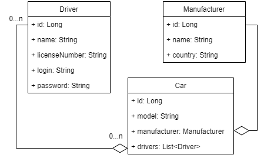

<h1>🚕Taxi-service🚕 </h1>
<h2>📝 Description:</h2>
This is a simple web-application of taxi-service.  
Project was implemented according to SOLID principles and has N-tire architecture.  

# <h2>🔥 Features:</h2>
* Create new Car / Manufacturer / Driver
* Authentication / Logout options for Driver
* Display cars by authenticated Driver
* Soft delete Car / Manufacturer / Driver
* Display all Cars / Manufacturers / Drivers
* Add Driver to Car

## <h2>🎫 Project structure:</h2>
* Presentation layer represented as JSP driven by Controllers (HttpServlets)
* Service layer with all business logic
* DAO layer with CRUD operations
<h3>📌 Entities relations in database: </h3>

## <h2>‍🔧 Technologies:</h2>
* JDK 11
* TomCat 9.0.69
* Maven 4.0
* MySQL 8.0.24
* JDBC
* Java Servlet API 4.0.1
* JSP
* JSTL 1.2
* HTML, CSS

## <h2>🚀 How to launch this project:</h2>
1. Install TomCat 9.0.69
2. Install MySQL
3. Clone project from GitHub
4. Use query from [init_db](src/main/resources/init_db.sql) to create schema & tables.
5. Configure [ConnectionUtil](src/main/java/taxi/util/ConnectionUtil.java), to connect with DB.  
(Set fields: URL, USERNAME, PASSWORD, JDBC_DRIVER to ur own)
6. Configure TomCat for this project
7. 🚀 Run & Enjoy 😺 
